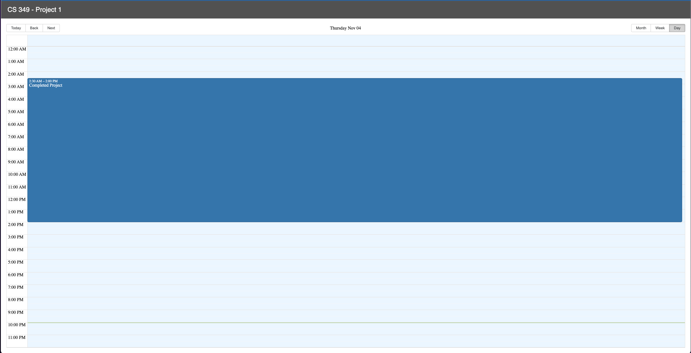

# 349 React Project

<style>
  body { background: rgb(60, 150, 191); }

  h1, p, img, h6 {
    text-align: center;
    color: #cfc547;
    text-shadow: 1px 1px 0px black
  }

  h1, h2, h3, span {
    color: green;
    text-shadow: 1px 1px 0px black
  }

  .linker { color: red }

  p { color: white }

  span.asterick {
    color: rgb(201, 188, 31);
  }

  img {
    width: 600px;
    /*height: 300px;*/
  }
</style>

This completed project is published and can be viewed
<a href="[/projects/markdown/](http://349.gonecoding.io/)" class="linker" title="Markdown Project Page">here</a>.

## HISTORY

TypeScript is a programming language which was developed by Microsoft. It was launched for public use in October 2012. It is free, open source and superset of the JavaScript. Maintained by Microsoft, the language comes with an addition of class-based object oriented programming, as well as optional static typing to the JavaScript.<span class="asterick">*</span> It is possible to create JavaScript applications for client or server side using the TypeScript.

###### *Wikipedia. "Typescript"

### LEARNED

It was a great opportunity to work with a great mind (<span>Thank you, Jake!</span>). He was patience in showing and sharing something new to me (`TypeScript`). The appreciation for Jake goes to how he processed the information. It showed me that it is not about trying to remember everything that I learned from coding, but remembering where and how to implement it into the coding/project. The internet is full of `free Source Code` and an explanation of how to implement it into our projects (Firebase being one source of reference).

### TypeScript is based on types

```tsx
function greeter(person: string) {
 return "Hello, " + person;
}

let user = "Jane User";

document.body.textContent = greeter(user);
```

- the parameter `person` is given the `type`: `string`
- in this way, a number cannot be applied

---

## CRUD Calendar (Month)


---

## CRUD Calendar (Week)


---

## CRUD Calendar (Day)



---

Authored by: Jake Hamo and Terrell D Lemons
